<h1>Compte Rendu</h1>
<h4>On crée un projet spring "Hospital"</h4>
<h4>On ajoute quatre classes </h4>
<h4>Classe Patient</h4>
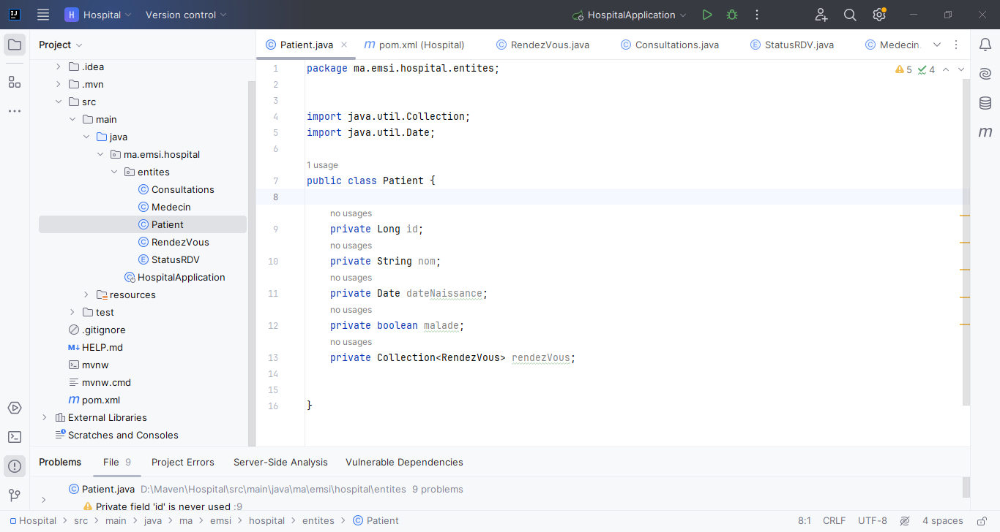
<h4>Classe Medecin</h4>
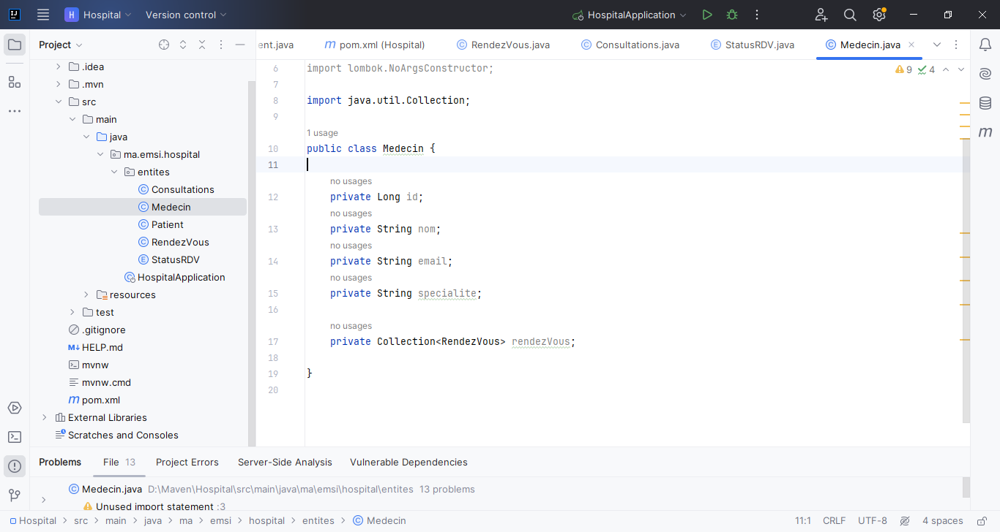
<h4>Classe RendezVous</h4>
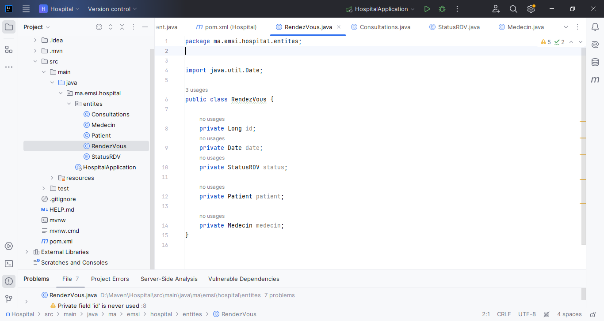
<h4>Classe Consultation</h4>
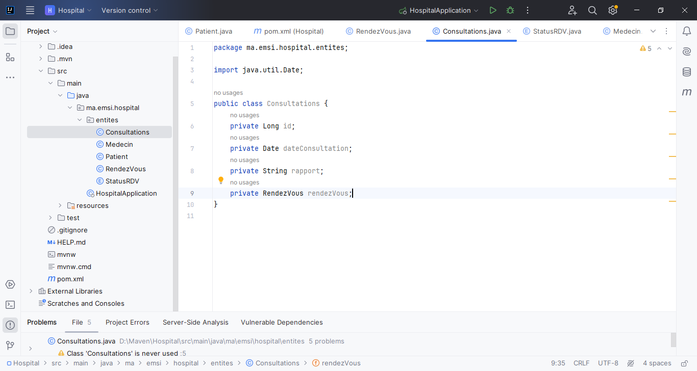
<h4>Enumeration StatusRDV</h4>
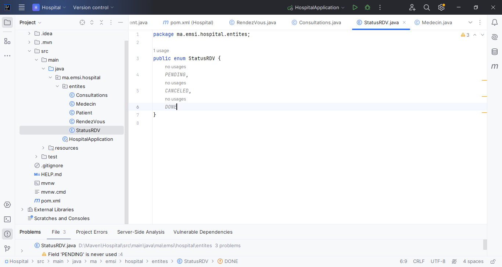
<h3>Aprés on fait le Mapping Objet Relationnel par les annotations</h3>
<h3>Dans la classe Patient</h3>
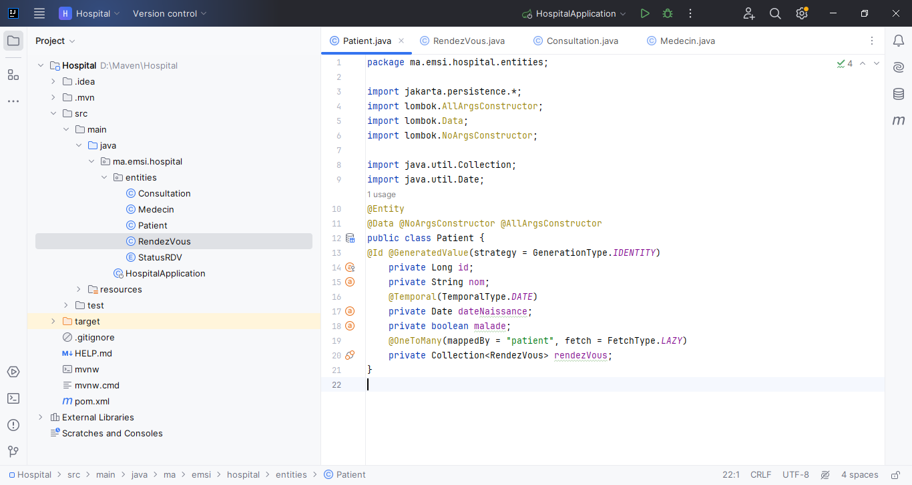
h3>Dans la classe RendezVous</h3>
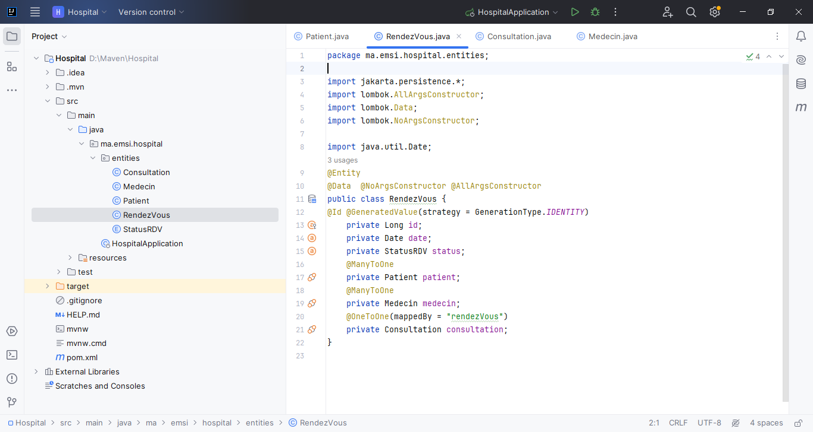
h3>Dans la classe Consultation</h3>
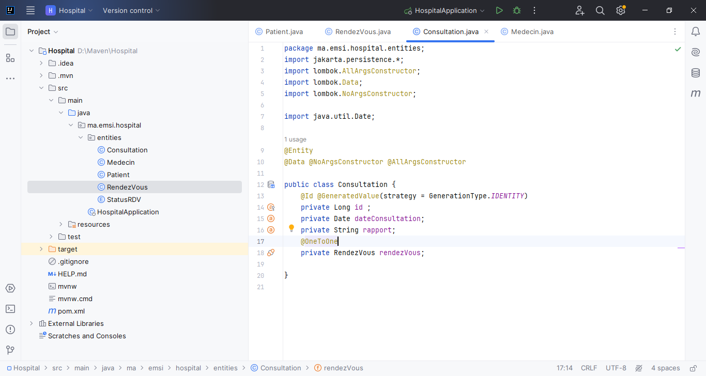
h3>Dans la classe Medecin</h3>
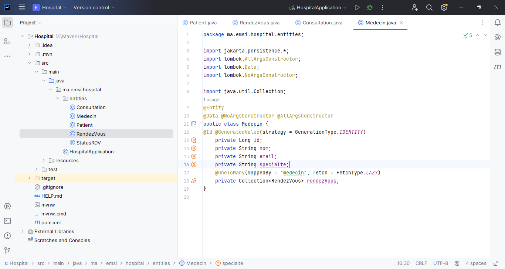
<h3>Pour verifier la base de données est ce qu'il est géneré on ajoute à "application.properties" quelques instructions </h3>
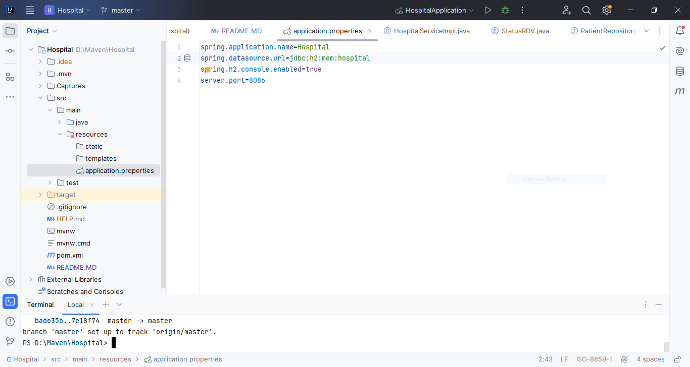
<h3>Aprés on met run la classe "HospitalApplication</h3>
<h3>dans browser on met localhost:8086/h2-console</h3>
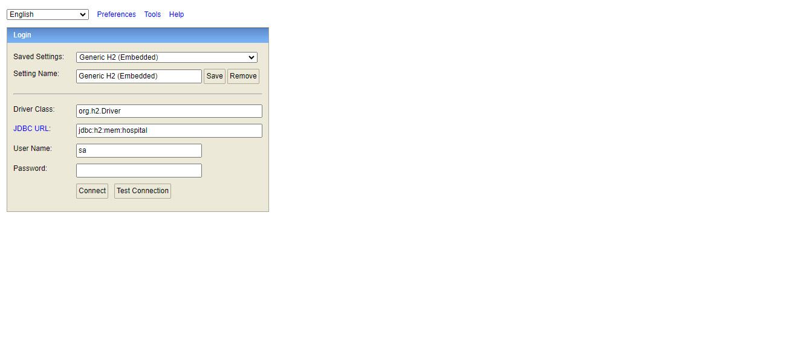