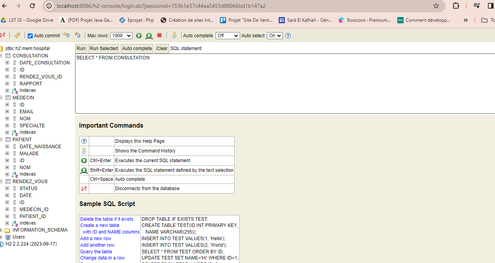
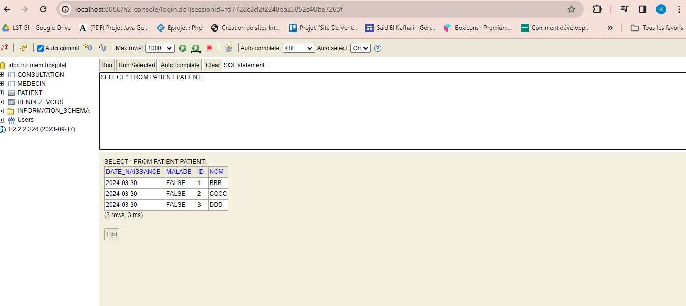
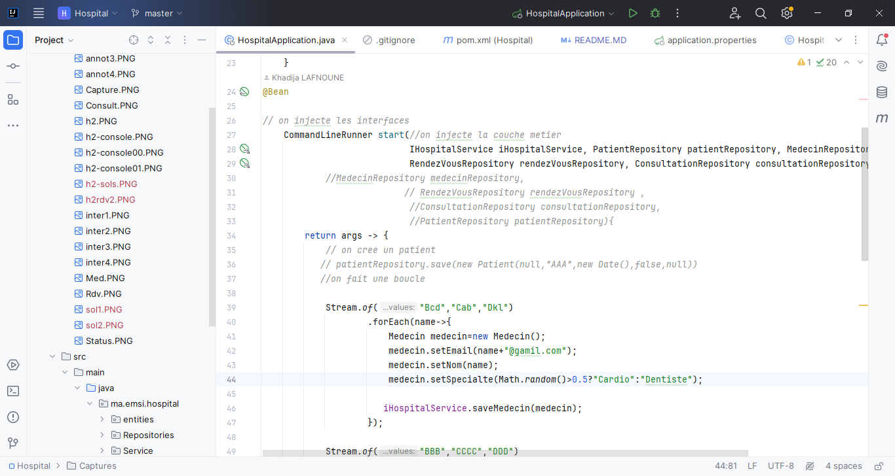
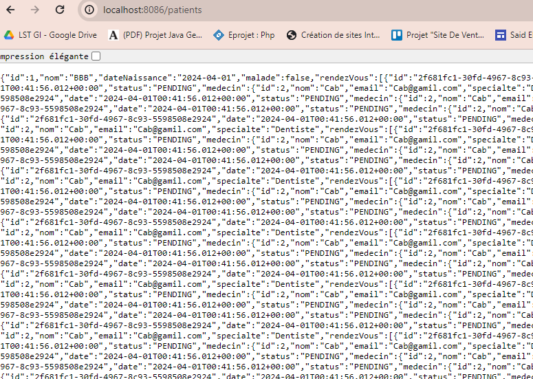

<h1>Compte Rendu</h1>
<h4>On crée un projet spring "Hospital"</h4>
<h4>On ajoute quatre classes </h4>
<h4>Classe Patient</h4>

<h4>Classe Medecin</h4>

<h4>Classe RendezVous</h4>

<h4>Classe Consultation</h4>

<h4>Enumeration StatusRDV</h4>

<h4>Aprés on fait le Mapping Objet Relationnel par les annotations</h4>
<h4>Dans la classe Patient</h4>

<h4>Dans la classe RendezVous</h4>

<h4>Dans la classe Consultation</h4>

<h4>Dans la classe Medecin</h4>

<h4>Pour verifier la base de données est ce qu'il est géneré on ajoute à "application.properties" quelques instructions </h4>

<h4>Aprés on met run la classe "HospitalApplication</h4>
<h4>dans browser on met localhost:8086/h2-console</h4>

<h4>On connect</h4>

<h4>Aprés on va crée des interfaces JPa Repositories</h4>
<h4>On crée un package Repository dans laquel on met les interfaces</h4>
<h4>l'interface PatientRepository</h4>

<h4>l'interface MedecinRepository</h4>
*
<h4>l'interface RendezVousRepository</h4>

<h4>l'interface ConsultationRepository</h4>

<h4>Pour testser on a deux solutions</h4>
<h4>La premiére </h4>

<h4>La deuxiéme est la plus recommandée</h4>

<h4>On fait run </h4>

<h4>meme pour medecin</h4>

<h4>meme pour RendezVous</h4>

<h4>meme pour Consultation</h4>

<h4>On crée un autre package pour couche metier "service"</h4>
<h4>on ajoute une interface</h4>

<h4>on ajoute aussi une classe qui implemente cette interface qui contient les traitements</h4>

<h4>On injecte la couche metier dand la classe "HospitalAppliocation"</h4>

<h4> pour donner au client le numero de RDV</h4>
<h4>Classe "HospitalApplication"</h4>

<h4>La classe "HospitalServiceImpl"</h4>

<h4>on modifie dans "HospitalApplication"</h4>

<h4>On modifie aussi Long par String dans "RendezVousRepository"</h4>

<h4>Aprés on fait run "HospitalApplication"</h4>

<h4>On cree un nouveau package "web" dans laquel on ajoute une classe "PatientRestController"</h4>

<h4>pour ne pas afficher les patients en json on modifie la classe "RendezVous"</h4>

